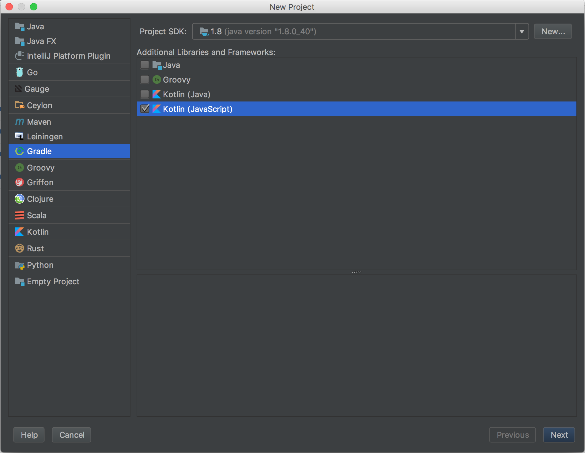

I really enjoy working with Kotlin. I've had my eye on it since its early days, and I've always viewed it as a language
which allows me to write Java the way that I actually *want* to write it. No more unnecessary verbosity in declaring
variables or data classes, bindings are immutable by default, string interpolation, `map`/`filter`/`reduce` without having
to use a `Stream`... you get the idea.

However, after the [1.1 announcement](http://kotlinlang.org/docs/reference/whatsnew11.html) the other day (particularly the
part about a [javascript backend](http://kotlinlang.org/docs/reference/whatsnew11.html#javascript-backend)), it could be the
case that Kotlin could provide not only a better way of writing Java, but a better way of writing Javascript as well.

## Compile-to-JS Languages

Now the concept of a language compiling to Javascript is nothing new. We've seen it before with [Scala.js](https://www.scala-js.org),
[ClojureScript](https://clojurescript.org), [Elm](http://elm-lang.org), and even more adventurous projects like 
[GCHJS](https://github.com/ghcjs/ghcjs), which compiles Haskell to Javascript. And it makes sense too - since Javascript is 
the only thing that can run on the web (aside from [WebAssembly](http://webassembly.org), which is a bit too experimental yet), any
code that we write ultimately needs to become Javascript. Hell, even [Typescript](http://www.typescriptlang.org) and the latest
versions of Javascript need to be compiled to the versions that browsers support.

So there's really no way around it: if you're writing a modern web application in 2017, you're going to be using some compile-to-js
language. Is Kotlin that language?

Well, let's give it a shot and see how it goes.

## Setting up a Project

As of this writing, it's still pretty new so there isn't a wealth of resources available on the topic. By the time you read this,
the documentation may have been updated, but I based this on the [tutorials and guides](https://kotlinlang.org/docs/tutorials/javascript/getting-started-gradle/getting-started-with-gradle.html)
on the Kotlin website, and I think that's probably the best place to start.

If you're using IntelliJ IDEA (including the Community Edition, which is free), there's an option to create a Kotlin project with
gradle, using a Javascript-backend. (Previously, in older versions of the Kotlin plugin, this was labeled as experimental, but as of
the 1.1 release, that's no longer the case. If you still see the experimental disclaimer, you should upgrade your plugin.)



Follow the steps and you'll be given a totally blank project, with just a `settings.gradle` file and a `build.gradle`. Let's tackle
that file first. I'll also note now that the finished result is 
[available on my github](https://github.com/kengorab/kotlin-javascript-boilerplate), so you can use it right away.

### The build.gradle File

After creating the project through the IntelliJ IDEA setup screen, the `build.gradle` file should look something like this:

```gradle
group 'co.kenrg'
version '1.0-SNAPSHOT'

buildscript {
    ext.kotlin_version = '1.1.1'

    repositories {
        mavenCentral()
    }
    dependencies {
        classpath "org.jetbrains.kotlin:kotlin-gradle-plugin:$kotlin_version"
    }
}

apply plugin: 'kotlin2js'

repositories {
    mavenCentral()
}

dependencies {
    compile "org.jetbrains.kotlin:kotlin-stdlib-js:$kotlin_version"
}
```

*(If you didn't create the project through IntelliJ, creating a new gradle project and including these changes in your `build.gradle`
file should produce the same results.)*

Following along in the Kotlin tutorial, the next thing they do is add an additional step in the gradle build process, and add
`build.doLast`. You don't need to do this. When the compiler generates the Javascript code from your Kotlin code, it also outputs
a file `kotlin.js`, the Kotlin standard library in Javascript. Your compiled Javascript code will likely heavily depend on this,
so it's a required dependency and must be loaded before our compiled code can work. However, by default the compiler puts it in
a different directory than the other compiled Javascript files, and this task moves it back.

If you don't want to do this, you can reference the standard library installed via `npm`/`yarn` (I recommend 
[yarn](https://yarnpkg.com)): `yarn add kotlin`/`npm install --save kotlin`.

The last thing to do here is to configure the compiler options. Here's what I use in my template project, which differs slightly from
what's in the Kotlin setup guide:

```gradle
compileKotlin2Js {
    kotlinOptions.outputFile = "${projectDir}/build/js/module.js"
    kotlinOptions.moduleKind = "umd"
    kotlinOptions.sourceMap = true
}
```

What do all of these mean? Well, the `outputFile` tells the compiler where the compiled Javascript file should end up (`${projectDir}`
is a variable provided by gradle, which represents the root of the project). As of this writing, the compiler does *not* support
multiple-module builds, so all of the Kotlin code will be compiled together into one single Javascript module. This is typically
what you'd want to do with a tool like [webpack](https://webpack.github.io), because it minimizes the number of files your users'
browsers will have to request. Typically, project code is split into the code that you write, and a "vendor" file, which is a bundle
of all of your code's dependencies (like React, Redux, etc).

The `moduleKind` here is set to `"umd"`; the options are `plain`, `amd`, `commonjs`, and `umd`. For those not familiar with Javascript 
module loaders, here's a brief rundown:

  - `plain`: This is the old-school way to work with Javascript; put a bunch of `<script>` tags in your html file, and all of your code
references variables on `window` (global scope). 
  - `amd`: An evolution of the plain method above, it provided a way for Javascript modules to define and provide dependencies for
other modules, and loaders like [require.js](http://requirejs.org) could request them asynchronously as the page loaded.
  - `commonjs`: CommonJS is more well-suited for server-side Javascript, and is the module loading system used in Node.
  - `umd`: "Universal Module Definition"; allows modules to intelligently decide which context they're being loaded into (AMD, 
CommonJS, or plain) and performs the necessary initialization and dependency providing. When in doubt, use UMD.

The last option is `sourceMap`, which I've set to `true`. Source maps are excellent tools for debugging; since our compiled Javascript
is generated code, it's not the prettiest to read, which could make debugging difficult. However, sourcemaps provide a way for
debugging tools to reference the compiled code back to the original code (in our case, the Kotlin), so errors and breakpoints will
appear with respect to the Kotlin, and not the generated, messy Javascript. It's an invaluable tool!

### Bring on the Kotlin!

Okay, that was a lot of setup and explanation around the `build.gradle` file, let's get onto writing some Kotlin!

Honestly, this is the part which I'll talk about the least, since my goal here is to get everything up and running and not to explore
everything that we can do just yet. Disappointing maybe, but I'll elaborate more in future posts.

Since there's nothing in the project except for the gradle files, let's create a Kotlin file, using the standard project organization
directory structure: `src/main/kotlin/co/kenrg/example/Main.kt`. You can choose whatever package name you want. Here's what I put in 
that file:

```kotlin
package co.kenrg.example

fun main(args: Array<String>) {
    println("Hello World!")
}
```

Boring, I know. "Hello World, what's so cool about that?" you may be saying. Well, let's give this a compile and see what we get!

In your terminal, run `./gradlew build`, and when it finishes check out the `build/js` directory. You should see a `module/` directory,
a `module.js` file, a `module.js.map` file, and a `module.meta.js` file. For now, let's just concern ourselves with `module.js`, which
is our compiled Kotlin code! You can take a look at the file, but you don't really need to ever know about what goes on in those
compiled files, thanks to sourcemaps (that's the `module.js.map` file, in case you were wondering).

## Running our Compiled Javascript

Now that we've built our Kotlin and have compiled Javascript, let's run it! If you followed my earlier instruction to 
`yarn add kotlin`/`npm install --save kotlin` (you may have needed to do a `yarn init`/`npm init` first), then we're ready to run
our compiled Javascript against Node!

In your terminal, run `node build/js/module.js`, and you should see the output "Hello World". Awesome, we've compiled our Kotlin code
to Javascript, and are running against Node server-side. Take a moment and think about how cool that is!

But what about running in the browser?

Well, if you remember, we've told the compiler that we want to compile into the UMD format, so running in the browser shouldn't be too
difficult. Let's make an `index.html` file in the root of our project:

```html
<html>
  <head>
    <title>Kotlin to Javascript</title>
  </head>
  <body>
    <script src="node_modules/kotlin/kotlin.js"></script>
    <script src="build/js/module.js"></script>
  </body>
</html>
```
*The `index.html` file in my template project is a little more decorated than this; this is barebones enough to see some output.*

You'll notice that there are two script tags, one for the standard library (which `npm`/`yarn` has installed into the `node_modules`
directory for us), and another for the Javascript assets we've built with `./gradlew build`. This is the old-school. "plain" way of
handling Javascript dependencies - files with dependencies on other files should be included after those dependent files. (You can
imagine how difficult this can get to manage, which is why module loading solutions like AMD, CommonJS, and UMD were developed).

Now let's open up this file in your web browser of choice (you can just open it up by dragging the file into a new Chrome window, using
the `file://` protocol linking to the file's patch on your filesystem, or by running `python -m SimpleHTTPServer` at the project
root and hitting `http://localhost:8000`).

If we look in the console, we see our "Hello World!" message! Awesome, so we've run the same Javascript code on the server-side using
Node, and in the browser. Who even cares that it's just a simple Hello World app... ship it!

## Okay that's cool, but...

Yeah, I know, a Hello World application isn't very awe-inspiring.

But that wasn't my intention with this. There's no point in writing a full-fledged React application in Kotlin to compile to Javascript
if you can't the Javascript-compilation step working correctly first. The cool stuff (not that this isn't cool, mind you!) can come
later now that the groundwork is in place. Everything needs a foundation on which to build!

## What's Next?

Well, starting from here we've gotten Kotlin to compile to Javascript that can execute in either the browser or in Node... where do 
we go next? Well, you should definitely check out the [kotlinx.html](https://github.com/Kotlin/kotlinx.html) library, which provides
an idiomatic-Kotlin way of writing HTML. Also, [showcased a bit](https://youtu.be/QQKdFFRqamg?t=21m8s) during the Kotlin 1.1 Event
last week was a React Kotlin wrapper library. When I asked later at the Q&A session about its release date, Andrey replied that it's
"coming soon", so I'll definitely be on the lookout for that!

Aside from that, I'm going to continue to explore Kotlin's Javascript build target, delving into how I can call existing libraries
(like lodash, perhaps) from Kotlin as well as the opposite, calling compiled-to-javascript Kotlin from existing Javascript code. I'll
try to record my findings and maybe publish another post about that soon.

I encourage you to look at the [code included in this article](https://github.com/kengorab/kotlin-javascript-boilerplate), and maybe
even fork it for your own project. Let me know if you have any suggestions for it as well. I'll probably add additional branches/tags
for other investigations I do in there, but I'll leave `master` in the state it's in as of this post.

## Should I use this for my next project?

Probably not. It's still very new, the documentation is lacking, and there are much more mature alternatives out there at the moment.
Don't get me wrong, it's definitely a project I have my eyes on, but there's no way it's going to compete with Scala.js right out of
the gate, or Clojurescript with [reagent](https://reagent-project.github.io) and [re-frame](https://github.com/Day8/re-frame). The
libraries, adoption, and interest just aren't high enough yet.

But definitely stay tuned to the project, I anticipate big things from the Kotlin team.
