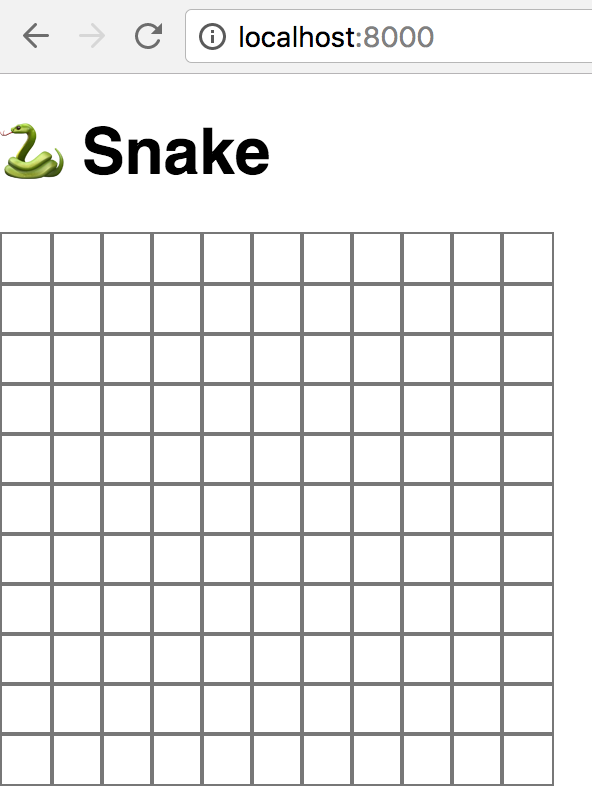

*This is Part 1 of a multi-part article series on writing the classic Snake game in Kotlin and compiling it to Javascript to
run in the browser. If you want to start from the beginning, you should check out [Part 0](/article/writing-snake-in-kotlin-js-0/)*.

*All of the code for this project will be available on [my github](https://github.com/kengorab/kotlin-js-snake/tree/master), and I'll
be starting from the tag `step-0`, right where the previous post left off. The results after this part will be saved as the tag
`step-1`.*

---

# The Plan

It's always a good idea to have a general plan for how a project should be laid out, and how its various components will link up,
even for small projects like this one. I've organized this project into 4 main parts:

  - The Grid: This is the area in which the game takes place; it's where the snake moves around in, and where the food appears
  - The Food: This should occupy 1 space in the grid, and if the snake "eats" it, it gets randomly placed in a new space
  - The Snake: This is the player; it's several contiguous spaces in the grid that move up/down/left/right, and eat food
  - The Game: This creates the grid, keeps track of the food and the snake, updates score, and runs the main game loop

In this part, let's create the Grid. It wouldn't be able to do much of anything without the Game, since that's what runs the game
loop and ties everything together, so we'll build a preliminary version of that as well; the Game that we build in this part will
grow over time.

# The Grid

Let's head over to our Kotlin code and create a new class called `Grid`. We know right away that we want our Grid to have a width
and a height, so let's get the basis of our class squared away:

```kotlin
class Grid(val width: Int, val height: Int) {
}
```

A grid is composed of many rows of cells, so we could add a property `val grid: List<List<Cell>>`, but what should `Cell` be?
A cell can be in 1 of 2 states - it can be filled or not filled. Also, since we're going to be using kotlinx.html to generate these
cells as `<div>`s, we'll need to store a reference to the actual underlying HTML element, so we can change its background color according
to its filled-ness. So now our `Grid` class could look something like this:

```kotlin
class Grid(val game: Game) : Component {
    data class Cell(val node: HTMLDivElement, var filled: Boolean)

    val grid: List<List<Cell>>

    init {
        this.grid = this.buildGrid()
    }
}
```

Okay, but what does that `buildGrid` function do? Well, we know we want to build a list of rows of cells, each of which has an HTML
`<div>` element and a boolean to denote whether or not it's filled in, so let's start with that and iterate on it.

```kotlin
    private fun buildGrid(): List<List<Cell>> {
        return (0..width).map { x ->
            (0..height).map { y ->
                val cell = document.create.div()
                Cell(cell, false)
            }
        }
    }
```

Here we're using the `div` extension function from the kotlinx.html library, so make sure you import `kotlinx.html.js.div`, if prompted.
We're also using Kotlin's [range operator](https://kotlinlang.org/docs/reference/ranges.html) here to very succinctly create a
list of lists (each "inner" list represents the row of `Cells`). Typically, in languages which don't encourage this kind of functional
style of programming (like Java, for example), this would be done using nested for-loops, and mutating list variables from outside of
the loops' closures. As a fan of functional, declarative programming, it makes far more sense to me to `map` over a range of numbers
and build up lists this way.

Just running this though won't actually do anything - we may have created these DOM nodes, but we haven't added them to the page at all!
To do that, we should probably have a place to put them, so let's head back to `Main.kt` for a second.

Currently, all our `main` function in `Main.kt` does is add an `<h1>` element to the page. Since we want to draw a grid, let's create
a container within which our grid's cells will be contained. The `main` function should now look like this:

```kotlin
fun main(args: Array<String>) {
    var gridContainer: Node? = null

    document.body?.append {
	h1 { +"🐍 Snake" }
	gridContainer = div { style = "position: relative" }
    }
}
```

The kotlinx.html DSL allows for assignment of created nodes to variables, so we can reference them later on. Our `gridContainer` div
has a style of `position: absolute`, which isn't particularly important - we're going to be positioning our cells absolutely, so this
helps our game to not look like *total* garbage.

Now that our `main` function has created the `gridContainer` local variable, add this as the last line:

```kotlin
val grid = Grid(10, 10, gridContainer)
```

This will not compile currently, because our `Grid` constructor only accepts 2 parameters (a width and a height), so let's add this
third one:

```kotlin
class Grid(val width: Int, val height: Int, val gridContainer: Node?) {
    ...
}
```

So, now that we're creating elements for each of our grid's cells, and we have a place to put them, let's arrange them into a grid.
Here's what the `Grid`'s `buildGrid` function looks like now:

```kotlin
private fun buildGrid(): List<List<Cell>> {
    val cellSize = 25

    return (0..width).map { x ->
        (0..height).map { y ->
            val cell = document.create.div()
            cell.style.apply {
                position = "absolute"
                width = "${cellSize}px"
                height = "${cellSize}px"
                left = "${x * cellSize}px"
                top = "${y * cellSize}px"
                border = "1px solid #777"
            }
            gridContainer?.appendChild(cell)
            Cell(cell, false)
        }
    }
}
```

What's new? Well, we're applying some styles to our cells now, which is just done by assigning to values of the `cell.style` property.

Note the use of the `.apply` block here. This is a useful feature of Kotlin, and is equivalent to writing:

```kotlin
cell.style.position = "absolute"
cell.style.width = "${cellSize}px"
cell.style.height = "${cellSize}px"
cell.style.left = "${x * cellSize}px"
cell.style.top = "${y * cellSize}px"
cell.style.border = "1px solid #777"
```

which removes a lot of repetitive and unnecessary stuff to read. Plus, it helps to group like things together; your eyes can see an
`.apply` block, and think "this is where all modifications to that value are happening".

We also do a bit of positioning using the `cellSize` variable (which is just hard-coded to be 25 pixels), and add a border of dark
grey. The last thing we do is append our newly-created and newly-styled div to the grid container that we've just added to our
`Grid` constructor, so our cells will actually appear on the page.

Let's run `./gradlew build`, refresh our web browser and *check out* what we've got!



*Yes, it's an 11x11 grid, even though our `main` function in `Main.kt` passes in a width and height of 10 when creating the `Grid`.
It's not super important, but we may as well fix it. In the `buildGrid` function in `Grid`, instead of mapping over the ranges
`(0..width)` and `(0..height)`, it should be `(0..width - 1)` and `(0..height - 1)`.*

That about wraps up the basics of the grid, though. There's one other thing that we need the grid to be able to do, and that's display
a filled-in square vs a white square when the cell's `filled` property is `true`. But, since nothing can set cells to be filled in yet,
we're going to wait.

Instead, let's lay out the basics of the `Game` and the game loop.

# The Game

In the same package as the `Grid`, create a `Game` class, which will be empty for now except for two functions: `start` and `stop`, two
commonly occurring actions in a game. We'll fill those in next.

```kotlin
package co.kenrg.snake

class Game {
    fun start() {

    }

    fun stop() {

    }
}
```

I will not claim to be an expert in writing games, but the absolute basics involve a "game loop" - an infinite loop which runs every few
milliseconds (however many times is necessary in order to achieve the desired frames per second, or FPS), and updates the state of the
game on each loop. In Javascript, this kind of thing can be done using the [setInterval](https://developer.mozilla.org/en-US/Add-ons/SDK/High-Level_APIs/timers#setInterval(callback_ms))
function available globally on `window`. This allows us to specify a block of code that will be continually run, and the interval at
which it will repeat.

Obviously we don't want to dispatch this function forever with no way of stopping it (aside from the user closing their browser tab
maybe, which isn't a good solution), so the `window.setInterval` function returns an integer. This number corresponds to some identifier
within the Javascript runtime, which isn't especially useful to us, but we can pass it to 
[clearInterval](https://developer.mozilla.org/en-US/Add-ons/SDK/High-Level_APIs/timers#clearInterval(ID)) (another function available
on `window`), which will stop our loop.

```kotlin
class Game {
    private var intervalLoopId: Int? = null
    private val framesPerSecond = 15

    fun update() {
        // Perform some logic here
    }

    fun start() {
        intervalLoopId = window.setInterval({
            this.update()
        }, 1000 / framesPerSecond)
    }

    fun stop() {
        if (intervalLoopId != null)
            window.clearInterval(intervalLoopId!!)
        intervalLoopId = null
    }
}
```

We won't have any updating logic for now (we'll get to that in a future post, once we start adding things that move, like the snake!)
but we *do* want the `Game` class to basically act as the puppeteer for the whole game application. That way, to our `Main.kt` class,
the API into our game (right now just starting and stopping it) is very well-defined. So, let's add the creation of our `Grid` instance
within the instantiation of the `Game` class.

This means that our `Game` class now needs to provide the `gridContainer` DOM node to our `Grid`. Rather than the `Game` class reaching
into the DOM tree we create in `Main.kt`, let's accept it as a parameter to the `Game` constructor. Our `Game` constructor should now
look like this:

```kotlin
class Game(val gridNode: Node?) {
  ...
}
```

and our `main` function within `Main.kt` should look like this:

```kotlin
fun main(args: Array<String>) {
    var gridContainer: Node? = null

    document.body?.append {
        h1 { +"🐍 Snake" }
        gridContainer = div { style = "position: relative" }
    }

    val game = Game(gridContainer)
    game.start()
}
```

Calling `game.start()` won't do anything right now, since nothing happens within the `update` function in `Game`, but let's do it
anyway. Also, it's important again to note the well-defined API of the `Game` class. Since we created the `gridContainer` in the 
`Main.kt` file, it makes sense that we pass it into the `Game` class, since it's a dependency of that class. The alternative would be
to do something resembling the jQuery days, wherein we assign an id to the `gridContainer`'s div, and then get a handle on it within
the `Game` class. If that last bit felt wrong, that's because it should! Passing the `gridContainer` into the `Game` class means that,
from this point on, we don't need to care about it with respect to the DOM. If we remove it, change its position, or rename it, the
core logic of the `Game` remains the same.

This may be a contrived example since everything is so simple, but this method of providing a class with all of its dependencies is a
model that's far easier to understand than giving the `Game` arcane knowledge of the HTML page defined pretty far away from it. And 
who knows what other classes might require access to it in the future.

Tangent aside, if we now build and run our app (using `./gradlew build` and `python -m SimpleHTTPServer`, in case you forgot), we 
should see nothing different, but this is exactly what we want!

## To be continued...

We now have our grid drawn, and the basic setup for our game and game loop. I think this is a good stopping point for this time around.
Next time, we'll work on filling in grid cells, and creating and placing food in the grid.

As with last time, the code in this article is available on my github, and the end result will be accessible at the 
[step-1 tag](https://github.com/kengorab/kotlin-js-snake/tree/step-1). Stay tuned for Part 2!
